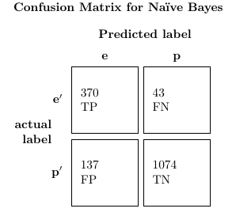
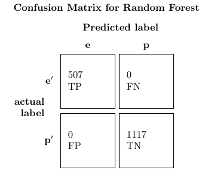

setwd(dirname(rstudioapi::getActiveDocumentContext()$path)) # This is for general case setting working directory.
```{r setup, include=FALSE}
knitr::opts_chunk$set(echo = TRUE)
```


## Setup of working
```{r working, include = TRUE} 
library(rstudioapi) 
library(e1071)
library(caret)
library(randomForest)
library(ggplot2)
library(knitr)
library(ROCR)
library(DiagrammeR)
library(caret)
library(mlbench)
library(pROC)
library(dplyr)
library(igraph)
library(ggraph)
library(class) # Order is important (masks knn function from igraph)
library(nnet)
#TODO Show tree growth, and argue, that this is how you set your parameters, in the 
#TODO Argue about the class distribution on the data that we're trying to predict, as shown below  
#x <- summary(test_data)
#x[1:2]
#TODO summarize the avg. error in a nice bar plot
#Compare the AUC for all the algorithms. 
#TODO Write conclusion which  sums the insights, and shows future work, that could be done.
#Write about the selection of methods, and why these precisely were chosen.
``` 

#Reasoning for choosing the dataset 
The mushroom dataset, is an older dataset from 1987 and is quite well studied. It is classified as a classification dataset on the UCI website, because it contains labled data, and has been used in many classification studies. It is interesting because it only contains nominal/categorical data, and my experience with nominal data is limited. In addition to being kind of a mycologist myself, and having a personal interest in solving this classifiation problem (to avoid being poisoned), I also expect decision trees to perform well in this domain, unlike some of the other models we have seen in the course such as Naïve Bayes. The dataset was also chosen because of the relatively high dimensionality and relatively high number of samples.      


## Loading data
```{r load_data, include=TRUE}
mushroom_data <- read.csv("../data/agaricus-lepiota.data", header = F,stringsAsFactors = TRUE)
names <- c("Class", "capshape","capsurface","capcolor","bruises","odor","gillattachment","gillspacing","gillsize","gillcolor","stalkshape","stalkroot","stalksurfaceabovering","stalksurfacebelowring","stalkcolorabovering","stalkcolorbelowring","veiltype","veilcolor",
"ringnumber","ringtype","sporeprintcolor","population","habitat")
length(names)
ncol(mushroom_data)


colnames(mushroom_data) = names #Renaming so we know this is the Class, and what the attributes are. Could also just have changed in the file, but in this way the reader can tag along. 
colnames(mushroom_data)

```


##Summary 
```{r summary, include=TRUE}
summary(mushroom_data)
set.seed(123) #Setting the random seed, for reproducibility 
``` 

So we have two classes edible and poisonous. We have 51.17 percent of the positive (edible class), so approximately equal class frequencies. 
Here we can see that column 17 only includes attributes with the value p, so this is a bit useless, and the randomForest algorithm "rf", as used in crossvalidation can handle this, so these are omitted. This attribute describes the veil-type which is a either partial or universal. In mushrooms such as the *amanita caesarea* the veil is universal when the musfhroom is young, and is broken as the mushroom grows. Ths is very common for adult mushrooms, and some like the famous *fly amanita* or as known by mycologist *amanita muscaria* has a very visible partial veil, which is the white dots on the red cap, that makes it so characteristic. It would be outside of the scope of this task to give more insight into the variables, but the reader can find more information here <https://archive.ics.uci.edu/ml/machine-learning-databases/mushroom/agaricus-lepiota.names>


```{r dropping_values, include=TRUE}
indices_without_17 <- c(1:16,18:ncol(mushroom_data))
 # The 17'th column only contains 1 attribute value, so it is omitted, because is useless information. 
mushroom_data <- mushroom_data[,indices_without_17]
mushroom_data_nolabel <- mushroom_data[,2:ncol(mushroom_data)]
summary(mushroom_data)
``` 

To have some test data and some training data, I do a simple split, so that we can build a model on a part of the data and validate on the other part of the data. 


##Gaining insight into the data
```{r barplots, include =TRUE}

for (i in 2:22) {
index <- i
names = c(rep("e",length(which(mushroom_data[,1] == "e"))),rep("p",length(which(mushroom_data[,1] == "p"))))
value = c(mushroom_data[which(mushroom_data[,1] =="e"),index],mushroom_data[which(mushroom_data[,1] =="p"),index])
data = data.frame(names,value)
attribute_boxplot <- qplot( x=names , y=value , data=data , geom=c("boxplot","jitter") , fill=names)
?qplot
print(attribute_boxplot + ggtitle(paste(names(mushroom_data[index]), "distribution in edible and poisonous mushrooms"), levels(mushroom_data[,]))) 
}
```

#TODO Write some awesome comments about the different attributes.

##Defining useful functions
```{r useful_functions, include=TRUE} 
precision <- function(confucius_matrix) {confucius_matrix$table[1,1]/(confucius_matrix$table[1,1] + confucius_matrix$table[2,1])}
recall <- function(confucius_matrix){confucius_matrix$table[1,1]/(confucius_matrix$table[1,1] + confucius_matrix$table[1,2])}
f1_measure <- function(confucius_matrix) {2*precision(confucius_matrix)*recall(confucius_matrix)/(precision(confucius_matrix) + recall(confucius_matrix))}
accuracy <- function(confucius_matrix){(confucius_matrix$table[1,1]+confucius_matrix$table[2,2])/(sum(confucius_matrix$table))}
eval_summary <- function(confucius_matrix){
  print(paste("precision: ", precision(confucius_matrix)))
  print(paste("recall:", recall(confucius_matrix)))
  print(paste("f1_measure: ", f1_measure(confucius_matrix)))
  print(paste("accuracy: ", accuracy(confucius_matrix)))
}

```

##Splitting
```{r splitting, include=TRUE}
  split_index <- ceiling(nrow(mushroom_data) * 0.8)
  train_data <- mushroom_data[1:split_index,]
  test_data <- mushroom_data[(split_index +1):nrow(mushroom_data),]
```


## Naive Bayes Classifier
```{r NaïveBayes, include=TRUE}
model <- naiveBayes(Class ~ .,data = train_data)
nb_pred <- predict(model,test_data)
correct_predictions <- nb_pred == test_data[,1]
#correct_predictions
t_correct_predictions <- as.data.frame(correct_predictions) #This is to get an overview of which are correctly classified and which are incorrectly classified. 
length(which(correct_predictions == TRUE %in% t_correct_predictions)) #Counting the number of values that are classified correctly. 


nb_avg_error <- mean(nb_pred != test_data[,1])
nb_avg_error # Just another evaluation measure

nb_confucius_matrix <- confusionMatrix(
                                      factor(nb_pred),
                                      factor(test_data[,1]))
nb_confucius_matrix # To output the result in comparison with the target. 
```


As can be seen here from the confusion matrix, there are only few true positives, when predicting if the mushrooms are edible. Which means we can't rely on our classification. The classification problem illustrates the necessity of making sensitive classifiers, cause here we're only 72.98% certain that the prediction of an edible mushroom is not poisonous. Here the sensitivity is calculated tp/(tp+fp), so the amount of true positives i.e. edible mushroms predicted as edible, out of total amount of mushrooms predicted as edible.  This is not good enough.! Hence we continue the search for a better classifier.   


##Knn classifier 
```{r Knn, include = TRUE} 
knn_train_data <- as.data.frame(sapply(train_data[,2:ncol(train_data)],as.integer)) # Changing the nominal data into integers, for knn to be able to understand it.
knn_test_data <- as.data.frame(sapply(test_data[,2:ncol(train_data)],as.integer))
target <- train_data[,1]

max_val = 0
best_K = -1

measure_list <- c()
for (i in 1:300) {
  knn_pred <- knn(knn_train_data,knn_test_data, target, k = i)
  knn_confucius_matrix <- confusionMatrix(factor(knn_pred),factor(test_data[,1]))
  #print(f1_measure(knn_confucius_matrix))
  measure_list <-c(measure_list, accuracy(knn_confucius_matrix) )
}

optimal_k <- which.is.max(measure_list)

paste("Optimal k:", optimal_k, " accuracy:", measure_list[optimal_k])
max(measure_list)


knn_pred <- knn(knn_train_data,knn_test_data, target, k = optimal_k)
#knn_pred # If we want to see the predictions

knn_confucius_matrix <- confusionMatrix(factor(knn_pred),factor(test_data[,1]))
knn_confucius_matrix 

knn_precision <- precision(knn_confucius_matrix)
knn_recall <- recall(knn_confucius_matrix) 
knn_f1_measure <- f1_measure(knn_confucius_matrix)
knn_accuracy <- f1_measure(knn_confucius_matrix)


knn_avg_error <- mean(knn_pred != test_data[,1])
knn_avg_error
eval_summary(knn_confucius_matrix)

```

Choosing the right K in the K nearest neighbor classifier is a hard task. Duda et al. popularized, that a good rule of thumb is to take the square root of the number of training instances. The area around this rule of thumb has been explored, but surprisingly found to be very limiting. Hence a large area, around this has been used to find a good k. This is based on the accuracy so hundreds of runs have been performed. A perhaps more application specific evaluation would be to minimize the number of false positives, because that could lead to poisoning.    


##Random Forest Classifier 
```{r random_forest, include = TRUE}
  rf_model <- randomForest(Class ~., data = train_data, importance=TRUE, proximity=TRUE, ntree=30)

#rf_model$predicted
  rf_pred <- predict(rf_model, test_data)
  rf_confucius_matrix <- confusionMatrix(factor(rf_pred),test_data[,1])
  rf_confucius_matrix
  avg_error <- mean(rf_pred != test_data[,1])
  avg_error # Just another evaluation measure
``` 


With a split at 80% training data and 20% test, the model performs impeccable. The random forest only takes the number of trees as argument, and here it was possible to obtain a perfect classification, with an accuracy of 1, when building 30 trees. The number of trees were incremented until a satisfying result were achieved, 

If we split at 60% and test on 40 percent of the data, then we still obtain a decent classifier however, we have a fairly low sensitivity at 89.91% meaning if we take tp/(tp+fp), meaning out of the total amount of times our classifier recommends us to eat the mushroom, we don't get poisoned in 89% of the time. Now if we randomly pick 10 mushrooms, and use our classifier to predict if we should eat them, and let's say there's an even probability for the mushrooms being poisonous and edible, then we have a 34% chance of not being poisoned, so this is not the greatest classifier. 

To see which attributes are important for the decision tree's we can make a variable importance plot. 

##Variable importance plot 
```{r varimpplot, include=TRUE} 
varImpPlot(rf_model,main ="Variable Importance Plot")
```

In the variable importance plot, we can interpret the MeanDecreaseGini for a variable, as the variables ability to decrease the impurity. The mean is then how well this variable decrease the impurity on average over it splits. It is clear that *odor* is by far the most important variable, and then *gillcolor* and *stalksurfaceabovering*. The importance of the variables, can be used to decrease the dimensionality, by only using the most important variables, this will decrease the variance of the model, and then be a part of avoiding overfitting the model, or as a tool to decrease computational complexity. 


##Plotting the randomForest
```{r rf_plot, include = TRUE}
library(dplyr)
library(ggraph)
library(igraph)
#This function is kindly taken from https://shiring.github.io/machine_learning/2017/03/16/rf_plot_ggraph
tree_func <- function(final_model, 
                      tree_num) {
  
  # get tree by index
  tree <- randomForest::getTree(final_model, 
                                k = tree_num, 
                                labelVar = TRUE) %>%
    tibble::rownames_to_column() %>%
    # make leaf split points to NA, so the 0s won't get plotted
    mutate(`split point` = ifelse(is.na(prediction), `split point`, NA))
  
  # prepare data frame for graph
  graph_frame <- data.frame(from = rep(tree$rowname, 2),
                            to = c(tree$`left daughter`, tree$`right daughter`))
  
  # convert to graph and delete the last node that we don't want to plot
  graph <- graph_from_data_frame(graph_frame) %>%
    delete_vertices("0")
  
  # set node labels
  V(graph)$node_label <- gsub("_", " ", as.character(tree$`split var`))
  V(graph)$leaf_label <- as.character(tree$prediction)
  V(graph)$split <- as.character(round(tree$`split point`, digits = 2))
  
  # plot
  plot <- ggraph(graph, 'dendrogram') + 
    theme_bw() +
    geom_edge_link() +
    geom_node_point() +
    geom_node_text(aes(label = node_label), na.rm = TRUE, repel = TRUE) +
    geom_node_label(aes(label = split), vjust = 2.5, na.rm = TRUE, fill = "white") +
    geom_node_label(aes(label = leaf_label, fill = leaf_label), na.rm = TRUE, 
					repel = TRUE, colour = "white", fontface = "bold", show.legend = FALSE) +
    theme(panel.grid.minor = element_blank(),
          panel.grid.major = element_blank(),
          panel.background = element_blank(),
          plot.background = element_rect(fill = "white"),
          panel.border = element_blank(),
          axis.line = element_blank(),
          axis.text.x = element_blank(),
          axis.text.y = element_blank(),
          axis.ticks = element_blank(),
          axis.title.x = element_blank(),
          axis.title.y = element_blank(),
          plot.title = element_text(size = 18))
  
  print(plot)
}

tree_num <- 1

tree_func(rf_model, tree_num)


```
Here's a tree to give insigt to how a tree in our plot looks like. We have so few trees, that it is possible to get an overview of the entire randomForest model. 


##Confusion Matrices for model comparison 
The confusion matrices are put here, for comparison. 

 


## Precision, recall, f1
#TODO insert precision, recall and f1 measure

##Roc curves for model comparison
Now we have seen some classifiers, let's plot some ROC curves. 
```{r roc_curves,include=TRUE}
test_data_t <- as.numeric(test_data[,1] == "e")


nb_pred_t <- as.numeric(nb_pred == "e")
nb_pred_obj <- prediction(nb_pred_t,test_data_t)
nb_performance <- performance(nb_pred_obj,measure="tpr",x.measure="fpr")
plot(nb_performance,main = "ROC Curve for RandomForest on Mushroom data",col = "blue",lwd=3) 
abline(a = 0, b = 1, lwd = 2, lty = 2) #Inserting a diagonal line in the ROC plot 
nb_roc_auc <- performance(nb_pred_obj,measure = "auc")
nb_roc_auc@y.values # Gives the auc value


knn_pred_t <- as.numeric(knn_pred == "e")
knn_pred_obj <- prediction(knn_pred_t, test_data_t)
knn_performance <- performance(knn_pred_obj,measure = "tpr", x.measure = "fpr")

plot(knn_performance,main = "ROC Curve for RandomForest on Mushroom data",col = "blue",lwd=3)
abline(a = 0, b = 1, lwd = 2, lty = 2)
knn_roc_auc <- performance(knn_pred_obj,measure = "auc")
knn_roc_auc@y.values # Gives the auc value


rf_pred_t <- as.numeric(rf_pred == "e")  #Done to make our data numeric so roc can understand the p and e names. 

#roc(test_data_t,pred_t,plot=TRUE) #I disliked this roc curve, because it was not visually precise enough. 

rf_pred_obj <- prediction(rf_pred_t,test_data_t)

rf_performance <- performance(rf_pred_obj,measure="tpr",x.measure="fpr")
plot(rf_performance,main = "ROC Curve for RandomForest on Mushroom data",col = "blue",lwd=3) # This plot is added because it gives a little bit more clarity.
abline(a = 0, b = 1, lwd = 2, lty = 2)
rf_roc_auc <- performance(rf_pred_obj,measure = "auc")
rf_roc_auc@y.values # Gives the auc value


```